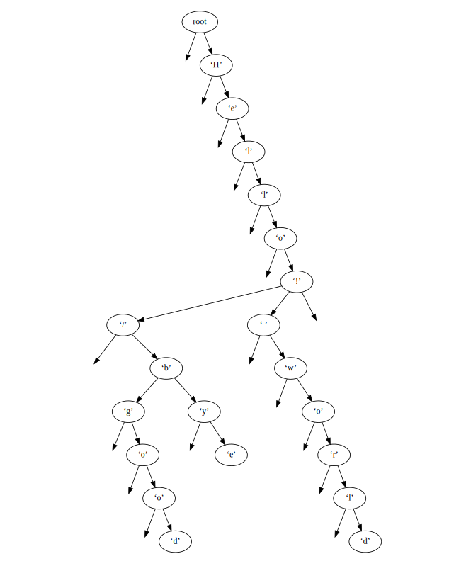

<!-- Copyright 2025 taylor.fish <contact@taylor.fish>
  This file is part of Eips, licensed under version 3 or later of the
  GNU Affero General Public License. -->
Design
======

Eips is an [operation-based][wp-op] [sequence CRDT][wp-seq] (also known as a
list CRDT). It supports three fundamental operations:

* **Insert** an element at a specified index.
* **Remove** (or delete) the element at a specified index.
* **Move** an element from one index to another.

[wp-op]: https://en.wikipedia.org/wiki/Conflict-free_replicated_data_type#Operation-based_CRDTs
[wp-seq]: https://en.wikipedia.org/wiki/Conflict-free_replicated_data_type#Sequence_CRDTs

Eips does not suffer from the *interleaving issues* that many sequence CRDTs
exhibit. Affected CRDTs may handle concurrent insertions of “Dog” and “Cat” at
the same position by producing “CDaotg”, but Eips will always produce “DogCat”
or “CatDog”. (Text typed in reverse, by typing a letter, moving the cursor back
one, typing the next character, and so on, does not cause interleaving in Eips
either.) For more information on interleaving issues, see [this paper][intanom]
by Kleppmann et al. (and the [followup paper][Fugue] by Weidner and Kleppmann).

[intanom]: https://martin.kleppmann.com/2019/03/25/papoc-interleaving-anomalies.html
[Fugue]: https://arxiv.org/abs/2305.00583

Eips also supports true move operations that do not duplicate elements when
they are moved by multiple users concurrently, as would occur from attempting
to move an element by deleting and re-inserting it. See [this paper][moving] by
Kleppmann for more information.

[moving]: https://martin.kleppmann.com/papers/list-move-papoc20.pdf

Contents
--------

* [Interface](#interface)
* [Conceptual model](#conceptual-model)
* [Implementation](#implementation)
  * [Node arena](#node-arena)
  * [Sibling set](#sibling-set)
  * [Position map](#position-map)
  * [Generating remote changes](#generating-remote-changes)
  * [Applying remote changes](#applying-remote-changes)
  * [Enumerating all remote changes](#enumerating-all-remote-changes)
* [Performance](#performance)
  * [Theoretical memory use](#theoretical-memory-use)
  * [Benchmark](#benchmark)

<h2 id="interface">Interface</h2>

Unlike some other CRDT implementations, in Eips, the *values* in the sequence
are not stored in the CRDT structure itself. They reside separately, in any
plain list-like type of user’s choice (which could be as simple as a standard
growable array like Rust’s [`Vec`]).

[`Vec`]: https://doc.rust-lang.org/stable/std/vec/struct.Vec.html

The job of the CRDT, then, is to translate between between *local changes* and
*remote changes*. Local changes use simple integer indices and are valid only
for a particular client. Remote changes use IDs and are suitable for sending
over a network.

A desired change to the document always begins as a local change (e.g., insert
“a” at index 3). Functions like [`insert`] translate these local changes into
[remote changes][RemoteChange], which are then broadcast over the network. Upon
receiving a remote change, each client [applies] the change, which converts it
back into a [local change][LocalChange] that tells the client how to modify the
local list of values. Indices are automatically adjusted to ensure eventual
consistency; for example, the earlier “insert ‘a’ at index 3” may turn into
“insert ‘a’ at index 5” on a client that concurrently inserts two characters at
index 3.

[RemoteChange]: https://docs.rs/eips/0.2/eips/change/struct.RemoteChange.html
[LocalChange]: https://docs.rs/eips/0.2/eips/change/enum.LocalChange.html
[`insert`]: https://docs.rs/eips/0.2/eips/struct.Eips.html#method.insert
[applies]: https://docs.rs/eips/0.2/eips/struct.Eips.html#method.apply_change

This approach of storing the values separately has the advantage that the time
complexity of local operations on the sequence of values depends only on the
number of *visible* (i.e., non-deleted) items in the sequence. Large numbers of
tombstones (deleted items, which in Eips and many other CRDTs are not fully
removed from the structure but rather marked as invisible) have no effect on
local operations like searching.

<h2 id="conceptual-model">Conceptual model</h2>

An Eips document is conceptually a binary tree, where an in-order traversal of
the tree yields the nodes in document order. Each node is associated with a
unique identifier. Eips allows any totally ordered type to be used as an
identifier; a common approach in contexts where clients have unique IDs is to
use (*client-id*, *counter*) pairs, where *counter* is is a monotonically
increasing per-client counter, but other approaches, such as UUIDs, are also
possible.

Nodes may have multiple left and/or right children as a result of concurrent
insertions. In this case, nodes with the same parent and direction (left/right)
are ordered by their identifiers, and an in-order traversal of a node *n* first
recursively visits all left children in order, then *n* itself, then all right
children in order.

To insert a new node *n* directly after an existing node *p*:

* If *p* has no right children, insert *n* as the sole right child of *p*.
* If *p* has right children, let *d* be the leftmost descendant of *p*’s first
  right child (this is the node immediately after *p* in an in-order
  traversal). Insert *n* as the sole left child of *d*.

*An example of a document tree. The text of this document is “Hello/goodbye
world!”. ‘/’ and ‘ ’ are both left children of their parent and thus concurrent
insertions.*

*Prior art:* This model is similar to other CRDTs such as [Treedoc] or, more
recently, [Fugue]. (Eips was developed in 2021, before the publication of
Fugue, but remained unpublished until 2025. Its approach in this regard happens
to be quite similar though, and much of the analysis of the lack of
interleaving issues in \[the regular, non-FugueMax version of] Fugue applies to
Eips as well.)

[Treedoc]: https://inria.hal.science/inria-00445975v1

<h2 id="implementation">Implementation</h2>

If Eips stored the document directly as the aforementioned binary tree, it
would not be able to guarantee logarithmic-time operations. A simple operation
such as retrieving the node at a particular index would require traversing the
tree, making it O(*h*), where *h* is the total number of characters ever
inserted (visible characters plus tombstones).

Instead, the structure of the document tree is represented implicitly through
several auxiliary data structures.

<h3 id="node-arena">Node arena</h3>

The *node arena* is responsible for allocating the main nodes that make up the
document (which may be called *document nodes* to distinguish them from other
kinds of nodes). One node per inserted element is required. Instead of a
requesting a separate block of memory from the operating system for each node,
which could result in significant overhead, the node arena allocates larger
blocks of memory (called *chunks*), each a multiple of the size of a node, and
allocates nodes contiguously from the memory within each block. The chunks are
fixed-size (to ensure *non-amortized* logarithmic performance) and form a
linked list, which allows simple linear-time iteration over all nodes in causal
order.

The Rust library [fixed-typed-arena] was developed for use in Eips and provides
this functionality.

[fixed-typed-arena]: https://github.com/taylordotfish/fixed-typed-arena

<h3 id="sibling-set">Sibling set</h3>

Eips needs a fast way to look up a node by its ID, and to find a node’s
siblings (other nodes with the same parent). Both of these are accomplished by
the *sibling set*.

The sibling set is a skip list containing two types of elements (or “nodes”):
parents and children. Each document node participates twice in the list, once
as a parent and once as a child ([tagged pointers] are used to encode this
efficiently). The elements of the skip list are ordered as follows:

[tagged pointers]: https://github.com/taylordotfish/tagged-pointer

* When comparing two parent nodes, the order is determined by the node’s ID.
* When comparing two child nodes, the order is determined by the ID of the
  node’s parent, then the node’s direction (whether the node is a left or right
  child, with left children first), then the node’s ID.
* When comparing a parent node with a child node, if the parent node’s ID is
  not equal to the ID of the child node’s parent, those IDs determine the
  order. Otherwise, the child node is ordered before the parent node if it is a
  left child, and after otherwise.

Lookup of a document node by ID is then simply a matter of finding the sibling
set parent node with the desired ID, a logarithmic-time operation because the
list is sorted.

Finding a node’s siblings involves finding the sibling set child node with the
desired ID (the ID of the desired node’s parent must also be known at this
point) and then moving forward and backward through the skip list. The siblings
will all be concentrated at this position, with only a single parent node
separating the left children from the right children. (Note that although the
skip list only maintains forward pointers, reverse iteration is possible
because some elements actually point up to the next level of the skip list in a
way that allows access to the element preceding any element in logarithmic
time. Eips does not actually need this functionality, though, and only iterates
forwards.)

The skip list Eips uses is *intrusive*, which means it does not allocate its
own leaf nodes. Instead, the “next” pointer that each node in a skip list
contains is stored in the document node itself, preventing the need for a
separate memory allocation. Two such pointers are stored in each document node
because the document nodes participate in the list twice, as a parent and a
child.

The skip list is also *deterministic*: it allocates internal nodes using a
deterministic algorithm (essentially the same approach as a B-tree) to ensure
*worst-case* logarithmic-time operations and linear space complexity. (To
reduce memory overhead, internal nodes are additionally allocated using a “bump
allocator”, which serves requests for small allocations of memory from larger
contiguous blocks, similar to the node arena. [fixed-bump] is used because it
provides worst-case non-amortized logarithmic-time allocations.)

[fixed-bump]: https://github.com/taylordotfish/fixed-bump

The Rust library [Skippy] was developed for use in Eips and provides this
functionality.

[Skippy]: https://github.com/taylordotfish/skippy

<h3 id="position-map">Position map</h3>

Eips also needs an efficient way to access nodes by index, to obtain the index
of an existing node, and to determine the index of a newly inserted node. The
*position map* accomplishes all of these tasks.

The position map is another deterministic intrusive skip list provided by
[Skippy]. However, unlike the sibling set, its elements are not sorted but are
rather ordered manually, much like a plain array or linked list. In addition,
each element has a notion of *size*, which enables logarithmic-time lookups by
index, and, due to the intrusive nature of the skip list (and because some
elements of the list contain parent pointers), logarithmic-time calculations of
an element’s index given a pointer to that element.

Like the sibling set, each document node participates twice in the position
map: once as a *normal node*, and once as a *marker node*. Normal nodes simply
represent an item in the document. Their size is 1 except if the item has been
deleted or moved to another location, in which case their size is 0. Marker
nodes always have a size of 0.

Normal nodes are always maintained in document order; that is, printing the
normal nodes out as they appear in the position map would yield the contents of
the document as a user would expect to see them. Marker nodes occur at specific
points interspersed among the normal nodes. If a document node is a left child,
its marker node is positioned according to what an in-order traversal of the
document tree would yield if the marker node were added as the new leftmost
child of the document node. This means it will occur immediately before the
entire subtree rooted at the document node, including marker nodes of
descendants. The complementary process is done for a right child: its marker
node is positioned as if it were the document node’s new rightmost child, which
means it occurs immediately after the subtree rooted at the document node
(including descendant marker nodes).

The position map and sibling set work together to allow the index of a newly
inserted node to be calculated efficiently. The sibling set allows fast access
to the new node’s siblings and parent. If the new node is a right child, and
it is not the first right child, its position in the position map should be
immediately after the *marker node* of the previous right child. If the new
node *is* the first right child, its position should be immediately after the
parent. The analysis for left children is similar: if the new node is not the
last left child, its position should be immediately before the next left child;
otherwise it occurs immediately before the parent. Once the appropriate
neighboring node in the position map is determined—either the marker node of
a sibling or that parent itself—the new node (and its marker node, which is
initially right next to it), can be inserted into the position map, which then
allows the index to be calculated. Operations on the sibling set and position
map take logarithmic time, so this process as a whole also runs in logarithmic
time.

*Prior art:* Eips’s position map has some similarities to the “range trees”
described in [this blog post][josephg] by Joseph Gentle, mainly with respect to
the idea of using an unsorted tree-like structure whose parent nodes track the
total size of their children. See also the [unsorted counted B-trees][cbtree]
described by Simon Tatham.

[josephg]: https://josephg.com/blog/crdts-go-brrr/
[cbtree]: https://www.chiark.greenend.org.uk/~sgtatham/algorithms/cbtree.html

*Update, 5 July 2025:* [Dr. Martin Kleppmann] has also pointed out similarities
between Eips’s skip lists (position map and sibling set) and the two B-trees
used in [Eg-walker], which he co-authored with Joseph Gentle. Both approaches
allow efficient ID-to-index and index-to-ID lookups.

[Dr. Martin Kleppmann]: https://martin.kleppmann.com/
[Eg-walker]: http://arxiv.org/abs/2409.14252

<h3 id="generating-remote-changes">Generating remote changes</h3>

This section describes how Eips generates [remote change objects][RemoteChange]
for insert, delete, and move operations. This is a read-only process: the CRDT
structure is not modified until the remote changes are later *applied*.

**Insertions:** As described in the conceptual model, recall that when
inserting a new node after an existing element *p*, the approach depends on
whether (the node corresponding to) *p* has a right child. If it does, the new
node is inserted as a left child of the leftmost descendant of *p*’s first
right child. A slight change to this process is made in the implementation of
Eips: rather than checking whether *p* has a right child, we check if *p* has a
*visible right descendant*, which is any right child of *p*, or any descendant
of a right child of *p*, that is marked as visible (i.e., not marked as hidden
due to being deleted or moved). If it does, the new node is inserted as a left
child of *p*’s first visible right descendant (as defined by an in-order
traversal); otherwise, the new node is inserted as a right child of *p*.
Because hidden nodes can never later be marked as visible, this modified
approach does not risk creating interleaving issues—new insertions may be
interleaved among *hidden* nodes, but those nodes do not affect the final
result, and Eips’s requirement of causal delivery ensures that such nodes will
already have been marked as hidden before a client receives the new insertion,
so there is no time at which interleaving of visible items could occur. This
modified approach is taken because it can be executed more efficiently.

The process of inserting a node at index *i* first begins by retrieving the
node at index *i* − 1 through use of the position map (the case where *i* = 0
is described later). Where *p* refers to that node, we check if *p* has a
visible right descendant as follows:

* If *p* is itself a right child of its parent, we use the position map to
  determine the index of *p*’s *marker* node in the position map. This marker
  node represents the right boundary of the subtree rooted at *p*: it
  necessarily occurs immediately after all of *p*’s children in an in-order
  traversal and before any other non-marker nodes. If the index of the marker
  node is greater than *i* − 1, *p* must have a visible right descendant.
* If *p* is a left child of a parent, we cannot use its marker node, which
  represents the *left* boundary of its subtree. Instead, we use the sibling
  set to find *p*’s last right child (possible in logarithmic time due to the
  sibling set’s ordering) and use the marker node of that child. As with the
  case where *p* is a right child, this marker node occurs after *p*’s children
  and before any other non-marker nodes. If *p* does not have a right child at
  all, there is trivially no visible right descendant; otherwise, there is a
  visible right descendant if and only if the index of the marker node is
  greater than *i* − 1.

If *p* does not have a visible right descendant, we return a remote change that
specifies the insertion of the new element as a right child of *p*. Otherwise,
we find *p*’s first visible right descendant by retrieving the node at index
*i* in the position map, and return a remote change that specifies the
insertion of a *left* child of that node.

If *i* = 0, we retrieve the node at index 0. If such a node exists, it is
necessarily a visible right descendant of the document root, so we return a
remote change that specifies the insertion of a left child of that node.
Otherwise, we return a remote change that specifies the insertion of a right
child with no parent, which represents an insertion directly under the root.

To **remove** an element at index *i*, we simply retrieve the corresponding
node from the position map and return a remote change that marks the node as
hidden. The node cannot be fully deleted because it may be the current or
future parent of other nodes.

**Move operations** require some background. Each node in Eips contains two
fields that are used when moving elements: an integer *move timestamp* and an
*other-node pointer*, which is a possibly null pointer to another node. If the
move timestamp is 0, the other-node pointer, if non-null, points to the *new
location* of the element that used to reside at this node. (In this case the
old node is marked as hidden because it no longer represents a visible
element.) By design, the new location’s move timestamp must be non-zero, which
means its other-node pointer (which cannot be null in this case) points to the
*old* node, which is always the node that corresponds to the original insertion
of the element before it was ever moved.

To move an element from index *j* to *k*, then, we first retrieve the node at
index *j* and make note of its move timestamp. The move timestamp of the remote
change will be one greater than this value. If the timestamp is currently
non-zero, the node represents the destination of moved element and must contain
an *other-node pointer* that points to the original node corresponding to the
initial insertion of the element. In this case, we use the ID of the *original
node* to identify the element being moved in the remote change; otherwise, we
use the ID of the node itself. We then follow the process for generating a
remote change for the *insertion* of a node at either index *k* or *k + 1*
(*k + 1* is needed when *k* > *j* to achieve a final index of *k* after the
move is completed). Finally, “move information”, consisting of the calculated
move timestamp and the ID of the old/original node, is added to the remote
change, and the change is returned.

<h3 id="applying-remote-changes">Applying remote changes</h3>

To incorporate a [remote change][RemoteChange] into the CRDT structure, the
change must be *applied*. This is the only process that actually mutates the
structure.

First, we check if a node with the remote change’s ID already exists through
use of the sibling set. If one does, we *merge* the metadata of the remote
change with what currently exists in the node. The only piece of data that can
change during this process is the node’s visibility (i.e., whether it is
deleted). If the node currently represents a visible element, but the remote
change specifies it should be deleted, we mark the node as such. The position
map must also be updated in this case: because the position map keeps track of
the size of its elements to provide by-index lookups, it must be told when the
size of an element changes. In this case, the size of the (non-marker) skip
list element corresponding to the now-deleted document node has changed from 1
to 0. (As with the other operations on Eips’s deterministic skip lists, this
process of updating the position map runs in logarithmic time.) Finally, we use
the position map to calculate the former index of the node that was just marked
as deleted, so that the remote change can be converted into a
[local][LocalChange] index-based one.

If an existing node is not found, we must insert one. Remote changes always
include the ID of the node’s parent, so with both the new node ID and the
parent ID, we can find the position in the sibling set at which the new node
(as a *child*—recall the two types of elements) should be inserted to maintain
sorted order. As described in the position map section, this can be used to
find a neighbor of the new node, which will always be either one of the node’s
siblings or the parent itself. That then allows the location of the new node in
the position map to be found efficiently—it will be immediately adjacent to
either the neighbor’s marker node (if the neighbor is a sibling), or the
neighbor itself (if the neighbor is the parent). The new node is then inserted
into the position map (once as a normal node and once as a marker node, which
at this time is adjacent to the normal node), as well as the sibling set (once
as a parent and once as a child).

For a typical insertion, the process is almost over. The last step is to use
the position map to determine the new node’s index, in order to turn the remote
change into a local index-based one. However, if the remote change actually
represents an operation to *move* an existing element to a new location,
additional steps are required.

Remote changes that represent move operations have additional “move
information” in them, consisting of a move timestamp (as described in the
section on generating remote changes), and the element’s original ID. (The
original ID is the ID of the node corresponding to the original insertion of
the element, before any moves. It is never the destination of a previous move
operation on this element.) We first use this information to determine the
current location of the element. After using the sibling set to find the node
corresponding to the original ID (the “original node”), we check if the
original node contains an other-node pointer. If it does, it must point to the
new location of the element (because original nodes always have a move
timestamp of 0), so we declare the target of the other-node pointer as the
*current location* (or “current node”). Otherwise, if the original node has no
other-node pointer, we declare the original node itself to be the current
location.

After finding the current node, we check if it is marked as hidden. If it is,
the element has already been deleted, so we insert the new node specified by
the remote change (i.e., the destination of the move operation) using the
typical process for insertions, but we mark it as hidden and do not emit a
local change.

If the current node is not hidden, we check its move timestamp. If its move
timestamp is greater than the move timestamp in the remote change (with node
IDs used as a tiebreaker), then the current location takes precedence over the
remote move operation and the element will not actually be moved. In this case,
we perform the same steps as we would if the element had been deleted: we
insert the new node specified by the remote operation but mark it as hidden and
do not emit a local change.

Finally, if the remote change’s move timestamp is greater, we first mark the
current location as hidden, making sure the position map is updated due to the
change in that node’s size. We also use the position map to calculate the
current node’s index (i.e., the current index of the element before being moved
by this remote change), which will be needed for the resulting local change. We
then insert the new node specified by the remote change, but this time as a
normal visible node. In this case, we also need to update the other-node
pointer in the *original* node (which may be but is not necessarily the same as
the current location) to point to the newly-inserted node. Finally, we
calculate the index of the newly-inserted node, which now represents the
location of the element, and return it, along with the old index calculated
earlier, as a local change.

As an additional detail, whenever a node with a non-zero move timestamp is
marked as hidden, either due to being deleted or moved (again), the reference
implementation of Eips clears the node’s move timestamp and other-node pointer,
resetting them to 0 and null, respectively. This is not strictly necessary, but
it keeps things simpler, as that move information is no longer needed.

<h3 id="enumerating-all-remote-changes">Enumerating all remote changes</h3>

One last piece of functionality Eips supports is the ability to obtain a list
of all remote changes for the entire document in causal order. This can be used
to send the entire document to a new client that has just joined the network.
Eips uses the node arena to iterate over all the document nodes in the order
they were allocated, which satisfies causality requirements. Each node is
converted to a remote change. This is a straightforward process of copying data
from the node into the remote change, and, for visible nodes, obtaining the
index of the node so the actual item can be retrieved from the local list of
values. There is one exception to this, however: if the node has a move
timestamp of 0 *and* has an other-node pointer (meaning it represents the
original location of an item that has been moved), the visibility of the remote
change is that of the *new* node stored in the other-node pointer, and the
index emitted along with the remote change is that of the new node as well.
This essentially produces a remote change that will replay the original
insertion of the item, before it was moved. When the new node is later
encountered in the process of iterating over all nodes, its remote change will
specify an operation to move the item appropriately.

Because this process requires calculating the index of nodes that correspond to
insertions of visible items (a logarithmic-time operation for each node), the
total time complexity of this process is O(*h* + *n* log *h*), where *n* is the
number of visible items in the document, and *h* is the total number of items
ever inserted, including deleted items and items moved to another location.
This time complexity is likely acceptable for most applications, but if strict
O(*h*) iteration is needed, it is possible to maintain a separate list of all
remote changes and their corresponding items, at the cost of using more memory.

<h2 id="performance">Performance</h2>

<h3 id="theoretical-memory-use">Theoretical memory use</h3>

The amount of memory used per item depends on the processor’s bit depth, the
size and alignment of the ID type, and whether move operations are enabled. On
a 64-bit system with 16-byte IDs aligned to 8 bytes (sufficient for a 64-bit
unique client ID and 64-bit per-client counter, or a 128-bit random UUID), and
with move operations enabled, each node (i.e., each insertion or move
operation) uses exactly 80 bytes of memory, plus some amount of overhead which
asymptotically decreases to 0 as the [`LIST_FANOUT`] and [`CHUNK_SIZE`]
parameters are increased. With the defaults of 12 and 32, respectively, the
amortized overhead per node is 26.05 bytes (this does not include overhead from
the system memory allocator, which is also expected to decrease as
[`CHUNK_SIZE`] is increased). Disabling move operations would decrease each
node’s memory use by 8 bytes (a reduction of up to 14 bytes is possible
depending on the size and alignment of the ID type).

[`LIST_FANOUT`]: https://docs.rs/eips/0.2/eips/options/trait.EipsOptions.html#associatedtype.ListFanout
[`CHUNK_SIZE`]: https://docs.rs/eips/0.2/eips/options/trait.EipsOptions.html#associatedtype.ChunkSize

<h3 id="benchmark">Benchmark</h3>

Eips includes a [benchmark program] to measure the speed and memory use of Eips
in practice. The program simulates a network of clients concurrently editing a
shared document, but does so within the same process (and thread) and without
any actual I/O. Each of the clients has its own copy of the CRDT structure and
text of the document. Given *c* as the number of clients, the benchmark
proceeds as follows:

[benchmark program]: ../benchmark

For each of *n* iterations:

1. Each client performs one random operation (insertion or removal of a
   character) on the document, at a random index. Insertions are configured to
   be twice as likely as removals. This produces *c* concurrent operations.
2. Each client broadcasts its operation to the other *c* - 1 clients (the
   operation was already applied on the client that generated it). To simulate
   network delay, the other clients do not apply this operation immediately but
   instead store it in a buffer.
3. Each client applies the oldest *b* operations in its buffer, where *b* is
   a random integer between 0 and 5*c* (inclusive). The probabilities are
   biased towards zero so that the expected value of *b* is *c*. Additionally,
   if a client’s buffer has grown beyond a defined limit (currently 3*c*),
   additional operations are applied until the buffer’s length is equal to the
   limit.

Finally, each client applies all remaining operations that may be in its
buffer. At this point all clients should see the exact same state of the
document, due to the eventual consistency guarantee of CRDTs.

For comparison, this benchmark was also executed with [Diamond Types], another
sequence CRDT implemented in Rust. Diamond Types does not support move
operations, so the benchmark only performs insertions and deletions, which
reduces Eips’s memory usage slightly as move operations can be globally
disabled in the [options][SupportsMove]. Diamond Types also stores the text of
the document in the CRDT structure itself, but Eips does not, so a separate
[`BTreeVec`] is used for Eips. Additionally, all random numbers in the
benchmark are generated by a deterministic algorithm to ensure that both Eips
and Diamond Types see the exact same sequence of operations.

[Diamond Types]: https://github.com/josephg/diamond-types
[SupportsMove]: https://docs.rs/eips/0.2/eips/options/trait.EipsOptions.html#associatedtype.SupportsMove
[`BTreeVec`]: https://docs.rs/btree-vec/0.3

The results of the benchmark are as follows (full data available [here][data]):

[data]: ../benchmark/data/2025-06-12.csv

<table>
    <thead>
        <tr>
            <th>Clients (<em>c</em>)</th>
            <th>Iterations (<em>n</em>)</th>
            <th>CRDT</th>
            <th>Time</th>
            <th>Memory</th>
        </tr>
    </thead>
    <tbody>
        <tr>
            <td rowspan="2">2</td>
            <td rowspan="2">10,000</td>
            <td>Eips</td>
            <td>0.0922 s</td>
            <td>2.96 MB</td>
        </tr>
        <tr>
            <td>Diamond Types</td>
            <td>3.47 s</td>
            <td>6.95 MB</td>
        </tr>
        <tr>
            <td rowspan="2">2</td>
            <td rowspan="2">100,000</td>
            <td>Eips</td>
            <td>1.43 s</td>
            <td>25.9 MB</td>
        </tr>
        <tr>
            <td>Diamond Types</td>
            <td>27.0 s</td>
            <td>62.9 MB</td>
        </tr>
        <tr>
            <td rowspan="2">2</td>
            <td rowspan="2">1,000,000</td>
            <td>Eips</td>
            <td>23.5 s</td>
            <td>255 MB</td>
        </tr>
        <tr>
            <td>Diamond Types</td>
            <td>279 s</td>
            <td>608 MB</td>
        </tr>
        <tr>
            <td rowspan="2">10</td>
            <td rowspan="2">20</td>
            <td>Eips</td>
            <td>0.00263 s</td>
            <td>651 kB</td>
        </tr>
        <tr>
            <td>Diamond Types</td>
            <td>5.48 s</td>
            <td>1.52 MB</td>
        </tr>
        <tr>
            <td rowspan="2">10</td>
            <td rowspan="2">60</td>
            <td>Eips</td>
            <td>0.00941 s</td>
            <td>908 kB</td>
        </tr>
        <tr>
            <td>Diamond Types</td>
            <td>142 s</td>
            <td>3.34 MB</td>
        </tr>
        <tr>
            <td rowspan="2">10</td>
            <td rowspan="2">200</td>
            <td>Eips</td>
            <td>0.0343 s</td>
            <td>1.83 MB</td>
        </tr>
        <tr>
            <td>Diamond Types</td>
            <td>4135 s</td>
            <td>8.52 MB</td>
        </tr>
        <tr>
            <td rowspan="2">10</td>
            <td rowspan="2">2000</td>
            <td>Eips</td>
            <td>0.506 s</td>
            <td>13.3 MB</td>
        </tr>
        <tr>
            <td>Diamond Types</td>
            <td>3,155,922 s (36.5 days)</td>
            <td>88.1 MB</td>
        </tr>
    </tbody>
</table>
